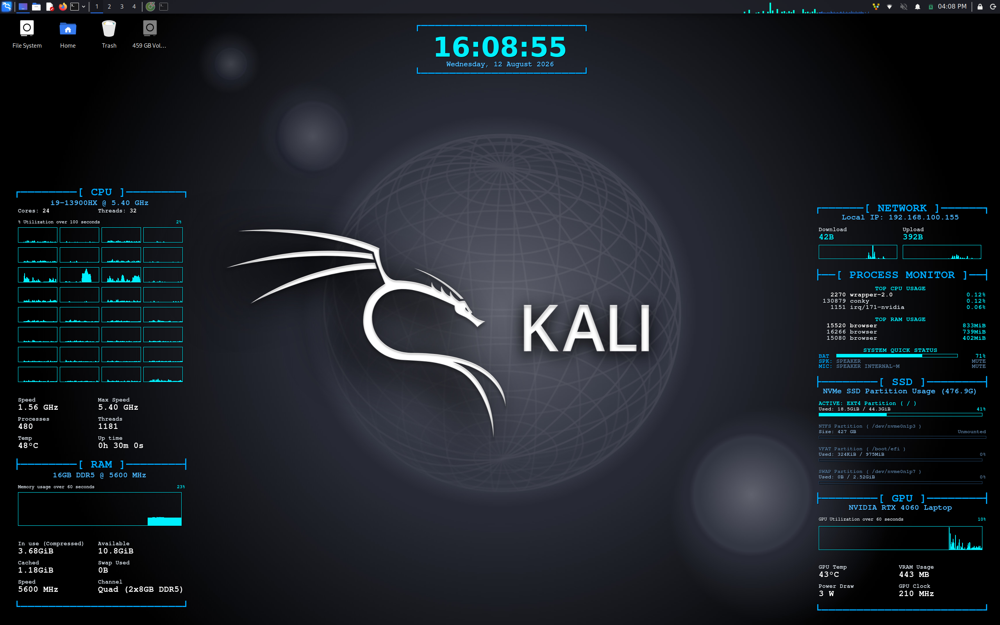

# Minimal Conky Linux

## 📸 Preview



## Yêu cầu

Cài các gói cơ bản (tên gói có thể khác nhau theo distro):

- `conky` hoặc `conky-all`
- `pactl` (thường từ `pulseaudio-utils` hoặc `pipewire-pulse`)
- `lm-sensors`
- `coreutils`, `awk`, `grep` (thường có sẵn)
- `nvidia-smi` (tuỳ chọn, chỉ cần nếu dùng widget GPU NVIDIA)

## Cài đặt

Clone repo rồi đặt vào đúng đường dẫn để script chạy sẵn hoạt động:

```bash
mkdir -p ~/.config
cp -r /duong-dan/to/minimal-conky-linux ~/.config/conky
```

Cấp quyền thực thi:

```bash
chmod +x ~/.config/conky/start_conky.sh
chmod +x ~/.config/conky/widgets/audio_status.sh
```

## Chạy thủ công

```bash
~/.config/conky/start_conky.sh
```

Script sẽ:

1. Tắt toàn bộ Conky đang chạy
2. Chạy 3 widget:
   - `clock.conf`
   - `cpu_ram.conf`
   - `graphics_disk.conf`

## Tự chạy khi boot (đăng nhập desktop)

Tạo file autostart:

```bash
mkdir -p ~/.config/autostart
cat > ~/.config/autostart/conky.desktop << 'DESKTOP'
[Desktop Entry]
Type=Application
Name=Conky Widgets
Exec=sh -c "sleep 10 && ~/.config/conky/start_conky.sh"
X-GNOME-Autostart-enabled=true
NoDisplay=false
Hidden=false
DESKTOP
```

Đăng xuất rồi đăng nhập lại để kiểm tra.

## Gỡ tự chạy

```bash
rm -f ~/.config/autostart/conky.desktop
```
